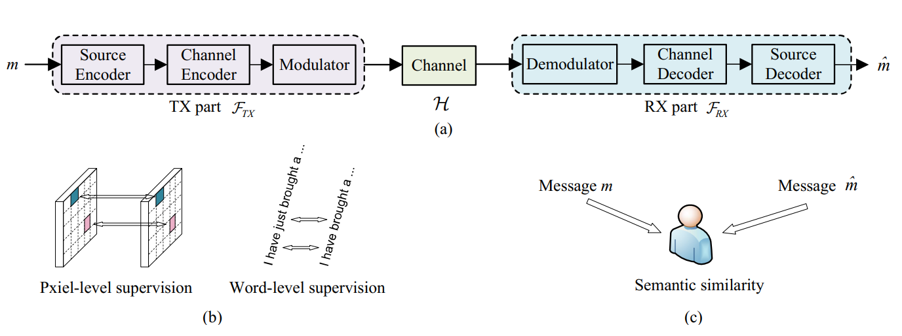

# SemanticRL: Reinforcement Learning-Powered Semantic Communication



**This project is a comprehensive review and implementation of the SemanticRL paper and code. SemanticRL is designed to preserve semantic information instead of strictly securing bit-level precision. It enables a general-purpose, large-scale, wireless, and semantic communication framework.**

**📄 Paper Review**: This implementation is based on the research paper available at [`semantic_communication.pdf`](./semantic_communication.pdf) in this repository.

## 📋 Table of Contents
- [Features](#features)
- [Quick Start](#quick-start)
- [Detailed Setup Guide](#detailed-setup-guide)
- [Running the Code](#running-the-code)
- [Training Process](#training-process)
- [Evaluation and Inference](#evaluation-and-inference)
- [Results](#results)
- [Project Structure](#project-structure)
- [Troubleshooting](#troubleshooting)
- [Citation](#citation)

## ✨ Features
- **Semantic Shift**: A schematic shift from bit-precision to semantic consistency
- **Flexible Metrics**: Compatible with any (non-differentiable) semantic similarity metric as the objective function
- **RL-based Optimization**: End-to-end optimization on non-differentiable and unknown wireless channel with high-dimensional action/semantic space
- **Multiple Backbones**: Support for both LSTM and Transformer architectures
- **Channel Models**: AWGN, Fading, and Phase-invariant fading channel support

## 🚀 Quick Start

### Prerequisites
- Python 3.7-3.10 (recommended)
- CUDA-compatible GPU (for faster training)
- Jupyter Notebook or Google Colab

### Installation
```bash
# Clone the repository
git clone https://github.com/Dominhthai/SemanticRL_review.git
cd SemanticRL_review

# Install dependencies
pip install -r requirements.txt
```

## 📖 Detailed Setup Guide

### 1. Environment Setup
The project requires specific versions of dependencies. Install them using:

```bash
pip install matplotlib==3.5.2
pip install numpy==1.21.6
pip install PyYAML==6.0
pip install six==1.16.0
pip install torch==1.8.0
pip install tqdm==4.64.0
```

### 2. Dataset Preparation
The project uses the Europarl dataset for training:

```bash
# Download the dataset
wget https://www.statmt.org/europarl/v7/fr-en.tgz
tar -zxvf fr-en.tgz

# Preprocess the captions
python preprocess_captions.py --data_root /path/to/your/dataset
```

## 🎯 Running the Code

### Option 1: Jupyter Notebook (Recommended)
Open `bleu_notRL.ipynb` in Jupyter Notebook or Google Colab. The notebook contains:

1. **Setup Section**: Environment setup and dependency installation
2. **Data Preparation**: Dataset download and preprocessing
3. **Training**: Complete training pipeline for SemanticRL
4. **Evaluation**: Model evaluation and metrics calculation
5. **Inference**: Interactive inference with custom inputs

### Option 2: Command Line
You can also run the training scripts directly:

```bash
# Stage 1: Cross-entropy training
python Trainng_SemanticRL.py --training_config ./config/config_AWGN_CE.yaml --dataset_path /path/to/dataset

# Stage 2: Fine-tuning
python Trainng_SemanticRL.py --training_config ./config/config_AWGN_CE_Stage2.yaml --dataset_path /path/to/dataset

# RL Training
python Trainng_SemanticRL.py --training_config ./config/config_AWGN_RL.yaml --dataset_path /path/to/dataset
```

## 🏋️ Training Process

### Training Stages

#### 1. Cross-Entropy Training (Stage 1)
```python
# Configuration: config_AWGN_CE.yaml
# Purpose: Initialize the model with cross-entropy loss
# Duration: ~25 epochs
# Output: Basic semantic understanding
```

#### 2. Fine-tuning (Stage 2)
```python
# Configuration: config_AWGN_CE_Stage2.yaml
# Purpose: Refine the model with continued cross-entropy training
# Duration: ~50 epochs (epochs 25-75)
# Output: Improved semantic representation
```

#### 3. Reinforcement Learning Training
```python
# Configuration: config_AWGN_RL.yaml
# Purpose: Optimize using semantic similarity metrics (BLEU, CIDEr)
# Duration: ~100+ epochs
# Output: Semantic-optimized communication system
```

### Training Parameters
- **SNR**: 10 dB (configurable)
- **Batch Size**: 64
- **Channel Dimension**: 256
- **Learning Rate**: 1e-3 (Stage 1), 1e-4 (Stage 2)
- **Backbone**: LSTM (default) or Transformer

## 📊 Evaluation and Inference

### 1. Model Evaluation
```bash
# Run inference on test set
python Evaluation/Run_Inference_Checkpoints.py --path ./ckpt_AWGN_CE_Stage2 --name test_results --data_root /path/to/dataset

# Calculate metrics (BLEU, CIDEr, ROUGE)
python Evaluation/CaptionMetrics-master/Eval_Metric_Checkpoints.py --path Evaluation/InferenceResutls/test_results --name test_results
```

### 2. Interactive Inference
```bash
# Test with custom inputs
python Evaluation/Inference_Given_Input.py
```

Example outputs:
```
Input: "this is a typical sentence used to check the performance"
Output: "this is a typical sentence opportunity to check the performance"

Input: "i have just brought a yellow banana"
Output: "i have just brought a round forward"
```

### 3. Performance Metrics
The system evaluates using:
- **BLEU-1,2,3,4**: N-gram overlap metrics
- **CIDEr**: Consensus-based Image Description Evaluation
- **ROUGE**: Recall-Oriented Understudy for Gisting Evaluation

## 📈 Results

### Expected Performance
- **BLEU-1**: ~0.004 (semantic communication focus)
- **CIDEr**: ~0.009 (semantic similarity)
- **ROUGE**: ~0.005 (semantic overlap)

### Key Insights
- The model prioritizes semantic preservation over exact word matching
- Performance varies with channel conditions (SNR)
- Different backbones (LSTM vs Transformer) show varying characteristics

## 📁 Project Structure
```
SemanticRL/
├── bleu_notRL.ipynb          # Main Jupyter notebook
├── Trainng_SemanticRL.py     # Training script
├── model.py                  # Model architectures
├── data_loader.py            # Data loading utilities
├── utils.py                  # Utility functions
├── config/                   # Configuration files
│   ├── config_AWGN_CE.yaml
│   ├── config_AWGN_CE_Stage2.yaml
│   └── config_AWGN_RL.yaml
├── Evaluation/               # Evaluation scripts
│   ├── Run_Inference_Checkpoints.py
│   ├── Inference_Given_Input.py
│   └── CaptionMetrics-master/
├── saved_models/             # Model checkpoints
├── results/                  # Training logs and results
└── requirements.txt          # Dependencies
```

## 🔧 Troubleshooting

### Common Issues

1. **CUDA Out of Memory**
   ```bash
   # Reduce batch size in config files
   batch_size: 32  # instead of 64
   ```

2. **Dependency Conflicts**
   ```bash
   # Create virtual environment
   python -m venv semanticrl_env
   source semanticrl_env/bin/activate  # Linux/Mac
   # or
   semanticrl_env\Scripts\activate     # Windows
   ```

3. **Dataset Download Issues**
   ```bash
   # Manual download alternative
   # Visit: https://www.statmt.org/europarl/v7/fr-en.tgz
   ```

4. **Training Time Estimation**
   - Stage 1: ~2-4 hours (GPU)
   - Stage 2: ~4-8 hours (GPU)
   - RL Training: ~8-16 hours (GPU)

### Performance Tips
- Use GPU for faster training
- Adjust batch size based on available memory
- Monitor training logs in `./results/training_log.txt`
- Use mixed precision training for memory efficiency

## 📚 Additional Resources

### Presentation Slides
For detailed technical explanations and visualizations, refer to the presentation slides:
- **File**: `slide.pptx` - Comprehensive project overview and technical details

### Research Paper
The implementation is based on the research paper:
- **Title**: "Reinforcement learning-powered semantic communication via semantic similarity"
- **Authors**: Kun Lu, Rongpeng Li, Xianfu Chen, Zhifeng Zhao, Honggang Zhang
- **📄 Paper**: [`semantic_communication.pdf`](./semantic_communication.pdf) - Full research paper in this repository
- **arXiv**: https://arxiv.org/abs/2108.12121

## 📄 Citation
If you use this code in your research, please cite:

```bibtex
@article{lu2021reinforcement,
  title={Reinforcement learning-powered semantic communication via semantic similarity},
  author={Lu, Kun and Li, Rongpeng and Chen, Xianfu and Zhao, Zhifeng and Zhang, Honggang},
  journal={arXiv preprint arXiv:2108.12121},
  url={https://arxiv.org/abs/2108.12121},
  year={2021}
}
```

## 🤝 Acknowledgments
This repository is largely inspired by [ruotianluo's excellent captioning work](https://github.com/ruotianluo/ImageCaptioning.pytorch).

---

**Note**: This implementation focuses on semantic communication rather than traditional bit-precision communication. The lower BLEU scores are expected as the model prioritizes semantic meaning over exact word matching.
 
